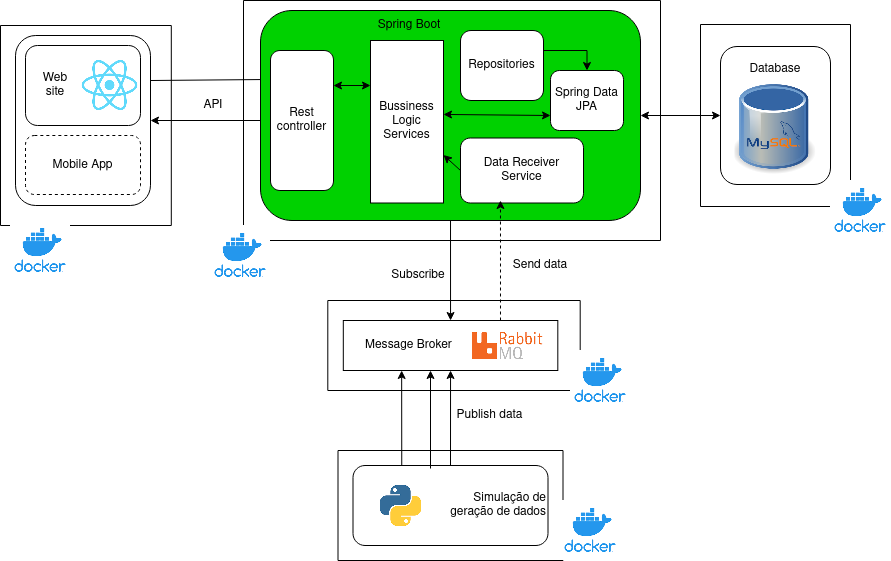

# Cheku

    Application for managing cars like a smart garage

 

  

 

Este projeto foi desenvolvido no âmbito da unidade curricular de [Introdução à Engenharia de Software](https://www.ua.pt/en/uc/12288), da licenciatura em Engenharia Informática da [Universidade de Aveiro](https://www.ua.pt/).

_Demostração_

 

# Sobre o projeto

O **Cheku** é uma aplicação de gestão de veículos que ajuda os utilizadores a gerenciar sua frota de maneira mais eficiente. A aplicação permite ainda acompanhar a localização geográfica dos veículos em tempo real, notifica os utilizadores de pagamentos de seguro e manutenções e permite compartilhar informações com outros membros da família ou da empresa. Além disso, o **Cheku** é compatível com uma ampla variedade de veículos e possui uma interface intuitiva e fácil de usar. O Cheku é ideal para quem precisa gerenciar mais de um veículo e oferece uma gestão colaborativa e eficiente da frota.
 

# Backlog
Foi utilizado o *Jira* para planear e documentar o projeto. É possível encontrar informção do projeto nos seguintes links:

- `Jira` [planeamento](https://cheku.atlassian.net/jira/software/projects/CHEK/boards/1/backlog)  
- `drive link` [documentação](https://uapt33090-my.sharepoint.com/:f:/g/personal/marianaandrade_ua_pt/EjbkBOygVNRNii7MnXxJxnIBDgwISWwrZxnWk3yRQOQ8JA?e=aZk7V2)  
- `Relatório editável` [relatório](https://uapt33090-my.sharepoint.com/:w:/g/personal/marianaandrade_ua_pt/EVQBLCJx8e9Bj1sgSpaUFwoBTiRJQOHefqdP0fmrEITK-A?e=cduirK )  

- [API documentation server link](https://documenter.getpostman.com/view/13973483/2s8YzMY5S1)

  
 

## Project Team

- **Team Manager and Developer:** [Diogo Magalhães](https://github.com/MagalhaesD77) (NMEC:102470)  
- **Product Owner and Developer** [Vicente Barros](https://github.com/v1centebarros) (NMEC:97787)  
- **Architect and Developer** [Mariana Andrade](https://github.com/MarianaAndrad) (NMEC:103823)  
- **DevOps and Developer** [Emanuel Marques](https://github.com/EmanGM) (NMEC:102565)  
 

# Arquitetura

  

 

## Componentes

- [**Apliacação Web (React)**](https://github.com/Cheku-Corporation/front-end)
- [**Serviço(Spring Boot)**](https://github.com/Cheku-Corporation/back-end)
- [**Message Broker (RabbitMQ)**](https://github.com/Cheku-Corporation/data-generator)
- [**Base de dados (MySQL)**](https://github.com/Cheku-Corporation/back-end/tree/main/mySql)
- **Geração de Dados (Python)**

 

# Executar localmente
Para executar o sistema em `localhost` é necessário ter o _Docker Compose_ instalado e atualizado.

Posto isto, os passos são os seguintes:

  1. Compile o código do serviço (dentro [do cheku](https://github.com/Cheku-Corporation/back-end/tree/main/cheku))

  2. Para cada serviço, construa os containers e inicie.

  3. Execute o comando `docker compose up` na raiz do projeto.

## Login Informações 

### Pessoa

**email**: `dario@gmail.com`  
**password**: `dario`

### Familia

#### _Admin_
**email**: `joao@gmail.com`  
**password**: `joao`

#### _Membro_
**email**: `matilde@gmail.com`  
**password**: `matilde`

### Empresa

#### _Admin_ 
**email**: `cheku@gmail.com`  
**password**: `cheku`

#### _Membro_
**email**: `bruno@gmail.com`  
**password**: `bruno`

# Detalhes
É possível encontrar mais informação sobre o projeto no [Relatório do Projeto]()  

**Aplicação web disponível em**:  [192.168.160.225](http://192.168.160.225/ )
