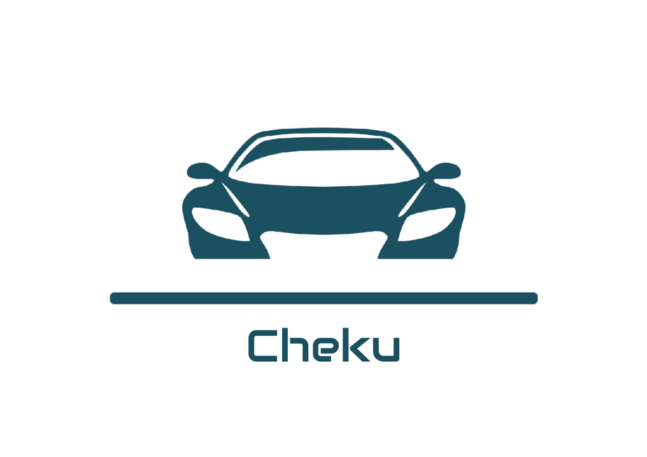

# Cheku

    Application for managing cars like a smart garage

 

  

 

Este projeto foi desenvolvido no âmbito da unidade curricular de [Introdução à Engenharia de Software](https://www.ua.pt/en/uc/12288), da licenciatura em Engenharia Informática da [Universidade de Aveiro](https://www.ua.pt/).
 

# Sobre o projeto

O **Cheku** é um sistema que visa facilitar a gestão de veículos, permitindo a sua gestão de forma simples e intuitiva. Este surge como uma alternativa aos diferentes sistemas de gestão de veículos existentes no mercado, que geralmente são específicos para uma determinada marca ou modelo de veículo.
O *Cheku* oferece ao utilizador um painel simples e intuitivo, onde pode gerir os seus veículos independentemente da marca ou modelo, registar as suas despesas e manutenções, e ainda consultar a sua localização geográfica.

 

# Backlog
Foi utilizado o *Jira* para planear e documentar o projeto. É possível encontrar informção do projeto nos seguintes links:

- `Jira` [planeamento](https://cheku.atlassian.net/jira/software/projects/CHEK/boards/1/backlog)  
- `drive link` [documentação](https://uapt33090-my.sharepoint.com/:f:/g/personal/marianaandrade_ua_pt/EjbkBOygVNRNii7MnXxJxnIBDgwISWwrZxnWk3yRQOQ8JA?e=hD2BQf)  
- `Relatório editável` [relatório](https://uapt33090-my.sharepoint.com/:w:/g/personal/marianaandrade_ua_pt/ESHHOn3N3h9KtF3OlTMt4I4BWKzw5qJiAZ-dbkbm4z4BDA?e=fKqeH9)  

- [API documentation server link](https://documenter.getpostman.com/view/13973483/2s8YzMY5S1)

  
 

## Project Team

- **Team Manager and Developer:** [Diogo Magalhães](https://github.com/MagalhaesD77) (NMEC:102470)  
- **Product Owner and Developer** [Vicente Barros](https://github.com/v1centebarros) (NMEC:97787)  
- **Architect and Developer** [Mariana Andrade](https://github.com/MarianaAndrad) (NMEC:103823)  
- **DevOps and Developer** [Emanuel Marques](https://github.com/EmanGM) (NMEC:102565)  
 

# Arquitetura

  

 

## Componentes

- [**Apliacação Web (React)**](https://github.com/Cheku-Corporation/front-end)
- [**Serviço(Spring Boot)**](https://github.com/Cheku-Corporation/back-end)
- [**Message Broker (RabbitMQ)**](https://github.com/Cheku-Corporation/data-generator)
- [**Base de dados (MySQL)**](https://github.com/Cheku-Corporation/back-end/tree/main/mySql)
- **Geração de Dados (Python)**

 

# Como Executar
Para executar o sistema em `localhost` é necessário ter o _Docker Compose_ instalado e atualizado.

Posto isto, os passos são os seguintes:

# _Deploy_ do Sistema

# Detalhes
É possível encontrar mais informação sobre o projeto no [Relatório do Projeto](https://uapt33090-my.sharepoint.com/:w:/r/personal/marianaandrade_ua_pt/_layouts/15/Doc.aspx?sourcedoc=%7B7D3AC721-DECD-4A1F-B45D-CE95332DE08E%7D&file=ReportPT.docx&action=default&mobileredirect=true)  

# Login Informações 

## Pessoa

**email**:`dario@gmail.com`
**password**:`dario`

## Familia

### Admin
**email**: `joao@gmail.com`
**password**:`joao`

### Membro
**email**: `matilde@gmail.com`
**password**:`matilde`

## Empresa

### Admin 
**email**: `cheku@gmail.com`
**password**:`cheku`

### Membro
**email**: `bruno@gmail.com`
**password**:`bruno`